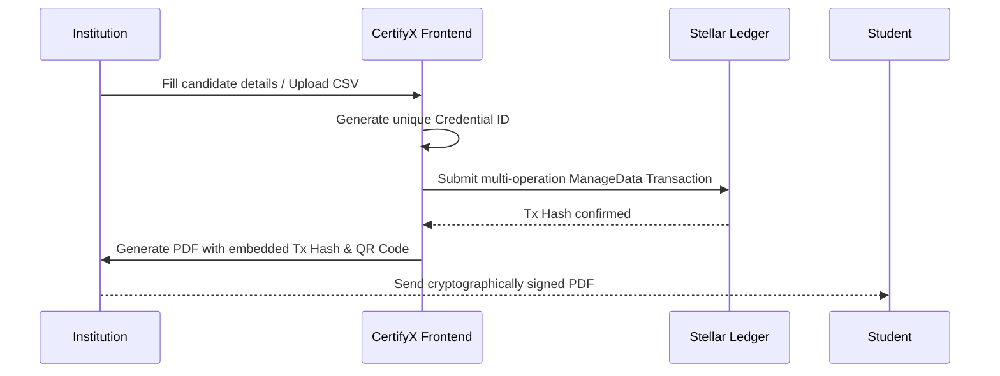

<div align="center">
  
# 🎓 CertifyX

**A next-generation platform for issuing, managing, and verifying cryptographic credentials on the Stellar blockchain using Soroban.**

[](https://opensource.org/licenses/MIT)
[](https://stellar.org/)
[](https://soroban.stellar.org/)

*An immersive, tamper-proof credentialing system where institutions can instantly issue certificates, and students can own and verify them forever on the Stellar ledger.*

</div>

---

## 📌 Quick Links

*   **💻 GitHub Repository**: [rohitmxc/certifyX](https://github.com/rohitmxc/certifyX)
*   **🌐 Live Production Link**: *(Coming Soon)*

---

## 📖 The Vision: Problem & Solution

### The Problem
Traditional credentialing systems rely on centralized databases that are vulnerable to data loss, fraud, and ongoing hosting costs. When institutions shut down or migrate servers, student credentials often disappear. Furthermore, verifying paper or standard PDF certificates is a manual, highly inefficient process for employers.

### The Solution: CertifyX
We solve this by introducing a decentralized, cryptographically secure credentialing environment:
- **Instant Issuance**: Institutions can design templates and issue credentials individually or in massive batches via CSV upload.
- **On-Chain Immutability**: Every certificate is anchored to the Stellar Testnet via a Soroban smart contract and `ManageData` operations.
- **Zero Storage Costs**: By leveraging the Stellar public ledger as the source of truth, there are no monthly database fees to maintain validity.
- **Instant Cryptographic Verification**: Every generated PDF contains a dynamic QR code and hyperlink pointing directly to the exact Stellar transaction hash on `stellar.expert`.
- **Premium Aesthetics**: Built with Next.js and Tailwind CSS, the platform features a sleek, professional Web3-native design.

---

## 🏆 Key Features

| Feature | Implementation |
|-------------|----------------|
| **Multi-Wallet Support** | Implemented persistent multi-wallet connectivity (Freighter, Albedo, xBull, LOBSTR) using `@creit.tech/stellar-wallets-kit`. |
| **Live Ledger Verification** | The platform dynamically queries the `StellarSdk.Horizon.Server` to display live XLM balances and prove credential issuance. |
| **React-PDF Generation** | Fully offline-capable, client-side vector PDF generation that perfectly renders custom certificates without server crashes. |
| **Batch Issuance Automation** | Seamlessly parse large CSV rosters and automatically process names, emails, and on-chain hashes for hundreds of students at once. |
| **Full Dashboard Experience** | Dedicated Next.js routes for issuing credentials, managing organization settings, and viewing a persistent issuance history via SQLite/Prisma. |

---

## 🛡️ Smart Contract & Blockchain Architecture

### Core Mechanism
When an institution issues a certificate, CertifyX doesn't just store a string. The transaction packages **four distinct cryptographic data entries** into a single atomic ledger submission via `ManageData` operations:

1. **Credential ID** -> `[Student Name]`
2. **Credential ID + Event** -> `[Event Name]`
3. **Credential ID + Date** -> `[Issue Date]`
4. **Credential ID + Type** -> `[Certificate Type]`

This provides 100% indisputable cryptographic proof of the student's exact credential details without needing to host any verification backend yourself!

### Smart Contract Flow


---

## 🛠️ Technology Stack
*   **Frontend**: Next.js 16 (App Router) + React 19 + TypeScript
*   **Styling & UI**: Tailwind CSS v4 + Lucide Icons
*   **PDF Generation**: `@react-pdf/renderer` + `html2canvas` + `jspdf`
*   **Database**: SQLite + Prisma ORM
*   **Stellar Integration**: `@stellar/stellar-sdk`, `@creit.tech/stellar-wallets-kit`
*   **Contracts**: Rust (Soroban SDK)

---

## 📁 Project Structure
The repository is cleanly organized as a monorepo:

```text
certifyX/
├── contracts/               # Soroban Smart Contracts (Rust)
│   ├── src/                 # Main logic for credential anchoring
│   └── Cargo.toml           # Rust dependencies
├── web/                     # Next.js Web Application
│   ├── prisma/              # SQLite database schema
│   ├── src/
│   │   ├── app/             # App Router pages and dashboards
│   │   ├── components/      # Reusable UI elements & React-PDF templates
│   │   └── api/             # REST endpoints for database persistence
└── README.md                # Project documentation
```

---

## 💻 Local Installation & Getting Started

### 📋 Prerequisites
*   Node.js 18+ or 20+
*   Cargo + Rust Toolchain (with `wasm32-unknown-unknown` target)
*   Soroban CLI
*   A Stellar Wallet (e.g., Freighter) installed on the Testnet

### 🛠️ Step-by-Step Setup

1. **Clone the Repository**:
   ```bash
   git clone https://github.com/rohitmxc/certifyX.git
   cd certifyX
   ```

2. **Setup the Database**:
   Navigate to the web directory and push the Prisma schema to generate the local SQLite database.
   ```bash
   cd web
   npm install
   npx prisma db push
   ```

3. **Run the Development Server**:
   Start the Next.js frontend application.
   ```bash
   npm run dev
   ```

4. **Access the Platform**:
   Open [http://localhost:3000](http://localhost:3000) in your browser. Connect your Stellar wallet and start issuing cryptographic credentials immediately!
